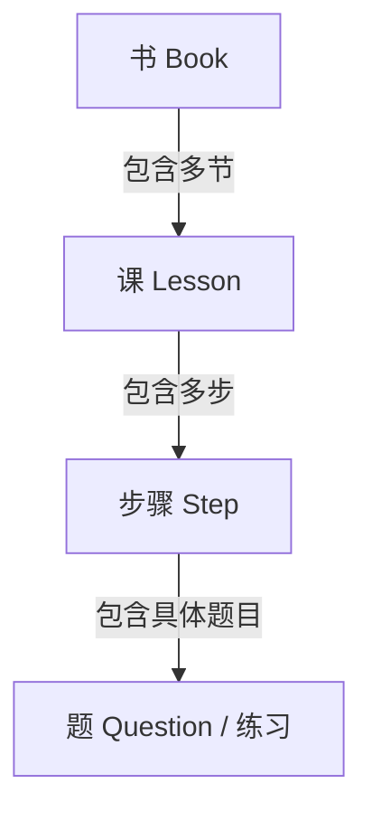

# Neo Concept — 需求文档（初版）

> 本文档是项目的最简需求基线，用于统一后续开发方向。标注 `[TODO: 用户填写]` 的地方需要你补充后再推进设计。

***

## 1. 产品概述

一款**离线优先**的系统化英语学习 App，内容参考《新概念英语》教材结构。核心目标是把“输入→理解→记忆→输出”的学习闭环拆成可操作的练习步骤，让用户在没有网络、没有社交干扰的情况下完成一课 15–25 分钟的学习。

- **目标平台**：先 Android（Kotlin + Jetpack Compose），iOS 版本后续复刻。
- **内容来源**：由另一个项目生成的课文、单词、练习题与配图，以 JSON + 图片形式导入本工程。
- **使用场景**：地铁、通勤、睡前等碎片时间，核心学习流程完全离线可用；课程配图采用在线 HTTPS + 离线占位策略以减小包体积。

***

## 2. 课程体系

### 2.1 总体结构

- 共分为 **4 本**（对应新概念英语 1–4 册）。
- 每本包含**数量不等的课程节数**，每节是一节独立的学习单元。
- 每节课由若干\*\*学习步骤（Step）\*\*组成，按认知难度递进。

### 2.2 课程步骤（已确认）

每节课为**顺序步骤 + 顶部小圆点进度 + 学完一步解锁下一步**的轮播结构，共 6 步：

1. **课文学习**：Banner 图 + 课文文本 + 内联查词 Modal + 核心词汇列表。
   - 课文按句子拆分，点击句子播放并高亮；整段播放时逐句顺序高亮。
   - 点击任意单词弹出居中 Modal：显示单词、音标、中文释义、例句，均可播放读音。
2. **填词练习**：从候选词中选择正确答案补全课文句子。
3. **拼写练习**：看中文释义拼写单词；首次错误显示上下文句子挖空，再次错误显示单词。
4. **阅读理解**：8–10 道四选一选择题，全部答对才算完成。
5. **口语练习（可跳过）**：跟读句子，ASR 识别对比；可点击「跳过口语」，不影响进入下一课。
6. **完成页**：展示本课重点词汇，提供「下一课」「返回目录」入口。

详细交互规范见 [docs/superpowers/specs/2026-06-30-lesson-interaction-design.md](docs/superpowers/specs/2026-06-30-lesson-interaction-design.md)。

***

#

