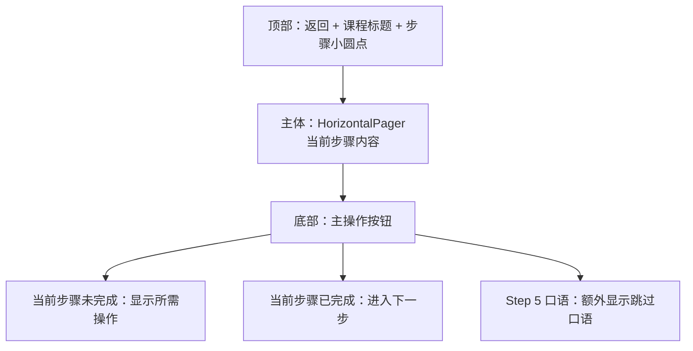
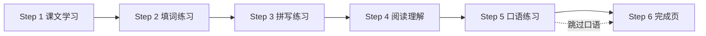

# Neo Concept — 课程学习页交互设计规范

> 状态：已确认
> 适用范围：Android 原生 App（Jetpack Compose），iOS 后续复刻

---

## 1. 设计目标

把一课的学习流程拆成可顺序完成的步骤，每一步职责单一，完成后解锁下一步。口语练习可跳过，方便用户在不便发声的场景继续学习。

---

## 2. 页面整体结构



- **顶部步骤指示器**：6 个小圆点，当前步骤高亮，未解锁步骤置灰。
- **主体**：`HorizontalPager`，仅允许滑动到已解锁步骤；未解锁步骤显示锁定遮罩。
- **底部按钮**：
  - 当前步骤未完成 → 显示该步骤所需操作（如「选择答案继续」）。
  - 当前步骤已完成 → 「进入下一步」。
  - Step 5 口语练习 → 额外显示「跳过口语」。

## 3. 步骤流转



---

## 4. 步骤定义

### Step 1 · 课文学习

**目标**：理解课文，预习核心词汇。

**界面元素**：
- **Banner 图**：在线 HTTPS 加载，失败/离线时显示占位背景 + 课程标题。
- **课文文本**：
  - 按句子拆分渲染。
  - 点击任意句子：播放该句 TTS，并高亮该句。
  - 点击整段播放按钮：依次播放每个句子，自动高亮当前句（通过句级拆分顺序播放实现，不依赖音频时间轴对齐）。
  - 点击任意单词：弹出居中 Modal，显示单词、音标、中文释义、例句；单词和例句均可点击播放读音。
- **核心词汇列表（可折叠）**：
  - 每项展示：单词 + 音标 + 释义 + 例句。
  - 点击单词或发音按钮播放发音。

**完成条件**：用户点击「开始学习单词/练习」按钮即视为完成（MVP 阶段不强制交互次数）。

---

### Step 2 · 填词练习

**目标**：通过选择而非拼写，巩固对课文关键词的识别。

**界面元素**：
- 从课文中抽取若干关键词，生成带空格的句子。
- 每个空格下方显示候选词列表（包含正确词和干扰词）。
- 点击空格聚焦，可播放完整句子。
- 提交后显示正确/错误，错误项显示正确答案并保留在列表中，用户需全部正确后才算完成。

**完成条件**：所有空均选对。

---

### Step 3 · 拼写练习

**目标**：从识别过渡到主动拼写。

**界面元素**：
- 展示中文释义（可点击播放读音 + 显示音标）。
- 输入框供用户拼写英文单词。
- **错误反馈机制**：
  1. 第一次错误：显示该词所在课文句子，句子中该词位置留空，用户再次输入。
  2. 第二次错误：直接显示正确单词，并要求用户抄写/确认后进入下一词。
- 所有词汇拼写正确后解锁下一步。

**JSON 依赖**：每个 `vocabulary` 项需关联包含该词的课文原句 `contextSentence`。

**完成条件**：所有词汇至少一次拼写正确。

---

### Step 4 · 阅读理解

**目标**：检测对课文内容的理解。

**界面元素**：
- 8–10 道选择题。
- 每题 4 个选项，单选。
- 全部答完后提交，显示正确/错误及解析。
- 错误题目需重新选择正确选项后才算完成。

**完成条件**：所有题目均答对。

---

### Step 5 · 口语练习（可跳过）

**目标**：输出练习，但不阻塞后续学习。

**界面元素**：
- 展示课文句子，用户点击录音按钮跟读。
- 使用本地 ASR 识别文本，与原句对比，给出匹配/不匹配反馈。
- 若 ASR 不可用，降级为「录音 + 回放」模式。
- 底部提供「跳过口语」按钮。

**完成条件**：
- 完成：用户至少尝试跟读一句（ASR 匹配与否不影响完成）。
- 跳过：用户点击「跳过口语」，该步骤标记为 `skipped`。

---

### Step 6 · 完成页

**目标**：结束一课，提供下一步入口。

**界面元素**：
- 显示本课重点词汇列表（可点击复习）。
- 不显示学习用时和正确率。
- 操作按钮：「下一课」、「返回目录」。

**完成条件**：进入该页即视为本课完成。

---

## 5. 课程完成状态

- **解锁下一课**：Step 1–4 完成，且 Step 5 完成或跳过。
- **课程状态存储**：
  - `lessonId`
  - `completedSteps`: List<Int>
  - `speakingSkipped`: Boolean
  - `isCompleted`: Boolean
  - `lastPosition`: Int（最后所在步骤，方便恢复）

---

## 6. 对课程 JSON 的额外要求

在 `REQUIREMENTS.md` 草案基础上，每个 `vocabulary` 项增加：

```json
{
  "word": "excuse",
  "phonetic": "/ɪkˈskjuːs/",
  "translation": "原谅；借口",
  "example": "Excuse me, where is the station?",
  "contextSentence": "Excuse me! Is this your handbag?",
  "audio": "book1/lesson01/excuse.mp3"
}
```

阅读理解题由生成器在 JSON 中直接提供：

```json
{
  "type": "comprehension",
  "questions": [
    {
      "question": "...",
      "options": ["A", "B", "C", "D"],
      "answer": 0,
      "explanation": "..."
    }
  ]
}
```

填词练习的挖空词和干扰词也建议在生成器侧生成，避免 App 端随机挖空导致不可控。

---

## 7. 待后续决定

1. 课文句子拆分规则：按英文句号/问号/感叹号拆分，是否需处理引号、省略号等边界情况？
2. Step 1 中「整段播放」时，句子之间是否插入固定停顿，还是立即播放下一句？
3. 用户返回已完成的课程时，是否允许直接跳到任意步骤复习？
