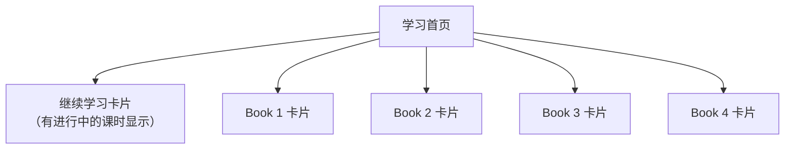
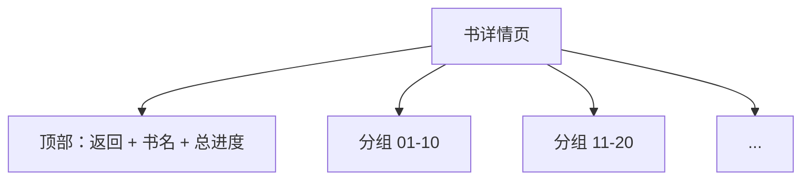
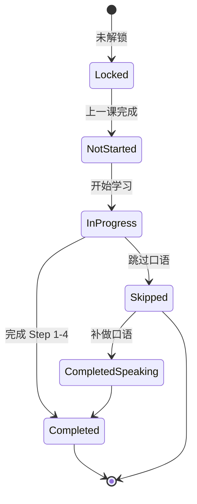

# Neo Concept — 书架与课程列表设计方案

> 状态：待用户确认
> 前提：无底部 Tab，首页即书架；书与课均建议顺序解锁。

---

## 1. 首页书架

### 1.1 整体布局



- **继续学习卡片**置顶（如有）。
- 下方是 4 本书的垂直卡片列表，每本书一个全宽大卡片。
- 按 Book 1 → Book 4 顺序排列。

### 1.2 单本书卡片元素

```
┌─────────────────────────────────────┐
│  01          FIRST THINGS FIRST     │
│  ─────────────────────────────────  │
│  144 课                          →  │
│  [═══════════        ]  已完成 72   │
└─────────────────────────────────────┘
```

- **左侧大编号**：01 / 02 / 03 / 04，强调色或黑色，字号最大。
- **书名**：大写英文书名（如 FIRST THINGS FIRST）。
- **副标题/中文名**：可选，小号字。
- **课程数量**：如「144 课」。
- **进度**：进度条 + 已完成课数/总课数。
- **箭头/状态图标**：当前进行中的书用强调色箭头；已完成的用对勾；未解锁的用锁。

### 1.3 书的状态

| 状态 | 视觉 | 交互 |
|------|------|------|
| 未解锁 | 灰色、透明度降低、锁图标 | 不可点击 |
| 进行中 | 黑色边框、强调色箭头 | 点击进入书详情 |
| 已完成 | 黑色背景 + 白色文字、对勾 | 点击进入书详情 |

---

## 2. 书详情页（课程列表）

### 2.1 页面结构

- **顶部栏**：返回键 + 书名 + 本书总进度。
- **课程列表**：垂直列表，按课号顺序排列。
- **分组**：每 10 课为一组，使用粘性分组标题（如「01–10」「11–20」），方便在 72–144 课的长列表中定位。



### 2.2 单行课程元素

```
┌─────────────────────────────────────┐
│  01  │  A Private Conversation   ✓  │
└─────────────────────────────────────┘
```

- **课号**：大号数字，左对齐。
- **课标题**：英文标题（如 A Private Conversation），正文大小。
- **状态图标**：右侧统一放置。

### 2.3 课程状态与图标

| 状态 | 图标 | 颜色 |
|------|------|------|
| 未开始 | 空心圆 | `border` |
| 进行中 | 实心圆 | `accent` |
| 已完成 | 对勾 | `success` 或 `foreground` |
| 已完成（口语待补） | 对勾 + 小圆点 | 对勾用 `success`，小圆点用 `warning` |
| 已锁定 | 锁 | `locked` |

> 口语待补状态：用户已完成 Step 1–4 但跳过了 Step 5，显示为「已完成但需补口语」，用 `warning` 小标签或圆点提示。

### 2.4 交互规则

- **未开始且已解锁**：点击进入学习页 Step 1。
- **进行中**：点击进入，恢复到上次步骤。
- **已完成**：点击进入，从 Step 1 开始复习。
- **口语待补**：点击进入，优先提示补口语；也可选择直接复习。
- **已锁定**：不可点击，点击时显示 Toast/提示「先完成前面的课程」。

---

## 3. 解锁规则

### 3.1 书级解锁

- Book 1：默认解锁。
- Book N（N ≥ 2）：Book N-1 的全部课程状态为「已完成」或「已完成（口语待补）」时解锁。

### 3.2 课级解锁

- 每本书的第 1 课默认解锁。
- 第 N 课：第 N-1 课状态为「已完成」或「已完成（口语待补）」时解锁。



---

## 4. 关键决策点

1. **首页 4 本书展示**：垂直大卡片列表，每卡包含大编号、书名、课数、进度、状态图标。
2. **书详情页**：课程列表，每 10 课一组粘性标题，单行显示课号、标题、状态图标。
3. **课程状态**：未开始 / 进行中 / 已完成 / 已完成（口语待补）/ 已锁定，共 5 种。
4. **解锁**：书和课都顺序解锁；口语跳过不影响解锁，但保留「待补」标记。
