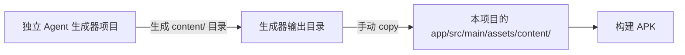
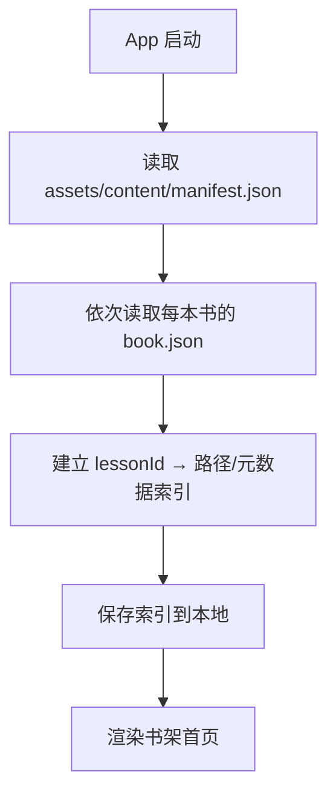

# Neo Concept — 内容清单与导入机制设计方案

> 状态：已确认
> 目标：确定课程 JSON、图片、清单文件的目录结构、命名规则与 App 发现/更新流程。

---

## 1. 核心决策建议

| 问题 | 建议方案 |
|------|----------|
| 课程数据放哪 | 构建时全部打包进 App 的 `assets/content/`，每一节课都是独立 JSON |
| Banner 图片 | 远程 HTTPS 地址，离线/加载失败时显示统一占位图 |
| App 如何发现课程 | 启动时读取本地 `assets/content/manifest.json` + 每本书的 `book.json` |
| 内容更新 | 随 App 版本更新；用户安装新版 APK 即可获得新内容 |
| 首次安装 | 打开即用，无需联网初始化 |

> 说明：课程 JSON、清单文件全部预置在 assets 中；仅 banner 图片策略待定。

---

## 2. 目录结构

```
app/src/main/assets/content/
├── manifest.json                 # 全局清单（构建时打包）
├── books/
│   ├── book01/
│   │   ├── book.json             # 本书元数据 + 课程索引
│   │   └── lessons/
│   │       ├── L01/
│   │       │   ├── lesson.json   # 课程数据（独立文件）
│   │       │   └── banner.webp   # 课程 banner（仅生成器侧产物；App 使用 book.json 中的 remote URL）
│   │       ├── L02/
│   │       │   ├── lesson.json
│   │       │   └── banner.webp
│   │       └── ...
│   ├── book02/
│   └── ...
```

### 2.1 命名规则

- 书目录：`book01`, `book02`, `book03`, `book04`
- 课目录：`L01`, `L02`, ... `L144`（固定两位或三位补零，与显示编号一致）
- 课程文件：`lesson.json`，每节课一个独立 JSON
- Banner 文件：`banner.webp`（优先 WebP，无则 fallback 到 `banner.jpg`）
- 音频：全部由本地 TTS 实时生成，不打包、不预录

### 2.2 Banner URL 约定

- `book.json` 中每个课程的 `banner.remote` 直接填写完整 HTTPS URL，App 不做自动推导。
- 推荐 URL 结构与目录结构保持一致，例如：
  `https://cdn.example.com/neo-concept/book01/L01/banner.webp`
- 生成器侧负责上传图片并写入 URL；App 端只读取并使用。

### 2.3 生成器与 App 的对接流程



- 内容由独立 Agent 项目生成，输出符合本规范的 `content/` 目录。
- 开发阶段手动将生成器输出 copy 到 App 的 `assets/content/`。
- 后续可引入构建脚本自动同步，但不属于当前需求范围。

---

## 3. 全局清单 `manifest.json`

### TypeScript 类型

```typescript
export interface BookMeta {
  id: string;
  title: string;
  subtitle: string;
  order: number;
  totalLessons: number;
  path: string;
}

export interface ContentManifest {
  version: string;
  schemaVersion: number;
  minAppVersion: string;
  updatedAt: string;
  books: BookMeta[];
}
```

### 示例

```json
{
  "version": "2024.07.01-1",
  "schemaVersion": 1,
  "minAppVersion": "1.0.0",
  "updatedAt": "2024-07-01",
  "books": [
    {
      "id": "book01",
      "title": "First Things First",
      "subtitle": "新概念英语第一册",
      "order": 1,
      "totalLessons": 144,
      "path": "books/book01/book.json"
    }
  ]
}
```

### 字段说明

- `version`：内容版本号，便于 App 追踪内容集版本（内容随 APK 更新时递增）。
- `schemaVersion`：课程 JSON Schema 版本，App 校验用。
- `minAppVersion`：最低 App 版本，防止旧版本读取不兼容数据。
- `books`：书列表，每本书指向自己的 `book.json`。

---

## 4. 单本书清单 `book.json`

### TypeScript 类型

```typescript
export interface LessonMeta {
  id: string;
  displayNumber: string;
  title: string;
  path: string;
  banner: Banner;
}

export interface BookManifest {
  id: string;
  title: string;
  subtitle: string;
  order: number;
  totalLessons: number;
  lessons: LessonMeta[];
}
```

### 示例

```json
{
  "id": "book01",
  "title": "First Things First",
  "subtitle": "新概念英语第一册",
  "order": 1,
  "totalLessons": 144,
  "lessons": [
    {
      "id": "book01-L01",
      "displayNumber": "01",
      "title": "Excuse me!",
      "path": "lessons/L01/lesson.json",
      "banner": {
        "local": null,
        "remote": "https://cdn.example.com/neo-concept/book01/L01/banner.webp",
        "placeholder": "banner_placeholder"
      }
    }
  ]
}
```

### 字段说明

- `id`：全局唯一课程 ID，后续用户进度、统计都绑定此 ID。
- `displayNumber`：显示用的课号（如 01、144）。
- `path`：相对 `book.json` 的课程 JSON 路径。
- `banner.local`：banner 的相对路径（相对 `book.json`），用于打包进 assets。
- `banner.remote`：可选远程 URL；如填写则优先在线加载，失败后回退到 `local` 或 `placeholder`。
- `banner.placeholder`：App 内置占位图资源名，当 `local` 与 `remote` 都不可用时显示。

---

## 5. 单课 JSON Schema（草案）

### TypeScript 类型定义（供生成器与参考使用）

```typescript
export interface Banner {
  local: string | null;
  remote: string | null;
  placeholder: string;
}

export interface Introduction {
  knowledgePoints: string[];
  speakingScenarios: string[];
  learningObjectives: string[];
}

export interface Sentence {
  id: string;
  text: string;
  // 用于口语练习：供 ASR 比对的归一化文本，去除标点、统一大小写
  normalizedText?: string;
}

export interface Paragraph {
  id: string;
  sentences: Sentence[];
}

export interface Text {
  paragraphs: Paragraph[];
}

export interface Vocabulary {
  id: string;
  word: string;
  phonetic: string;
  translation: string;
  example: string;
  contextSentence: string;
}

export interface FillInBlank {
  id: string;
  sentence: string;
  answer: string;
  options: string[];
}

export interface Spelling {
  id: string;
  // 引用 vocabulary 中对应词条的 id，避免重复存储 phonetic/translation/contextSentence
  vocabularyId: string;
}

export interface ComprehensionQuestion {
  id: string;
  question: string;
  options: string[];
  answer: number;
  explanation: string;
}

export interface Comprehension {
  questions: ComprehensionQuestion[];
}

export interface Speaking {
  sentences: Sentence[];
}

export interface Exercises {
  fillInBlanks: FillInBlank[];
  spelling: Spelling[];
  comprehension: Comprehension;
  speaking: Speaking;
}

export interface Lesson {
  id: string;
  bookId: string;
  displayNumber: string;
  title: string;
  subtitle: string;
  banner: Banner;
  introduction: Introduction;
  text: Text;
  vocabulary: Vocabulary[];
  exercises: Exercises;
}
```

### 示例

```json
{
  "id": "book01-L01",
  "bookId": "book01",
  "displayNumber": "01",
  "title": "Excuse me!",
  "subtitle": "",
  "banner": {
    "local": null,
    "remote": "https://cdn.example.com/neo-concept/book01/L01/banner.webp",
    "placeholder": "banner_placeholder"
  },
  "introduction": {
    "knowledgePoints": ["疑问句 'Is this your...?' 的用法", "礼貌用语 'Excuse me'"],
    "speakingScenarios": ["在公共场合向陌生人询问物品归属"],
    "learningObjectives": ["能用 'Is this your...?' 询问物品归属", "能听懂并回应 'Yes, it is.' / 'Pardon?'"]
  },
  "text": {
    "paragraphs": [
      {
        "id": "p1",
        "sentences": [
          { "id": "s1", "text": "Excuse me!" },
          { "id": "s2", "text": "Yes?" },
          { "id": "s3", "text": "Is this your handbag?" },
          { "id": "s4", "text": "Pardon?" },
          { "id": "s5", "text": "Is this your handbag?" },
          { "id": "s6", "text": "Yes, it is." },
          { "id": "s7", "text": "Thank you very much." }
        ]
      }
    ]
  },
  "vocabulary": [
    {
      "id": "v1",
      "word": "excuse",
      "phonetic": "/ɪkˈskjuːs/",
      "translation": "原谅；借口",
      "example": "Excuse me, where is the station?",
      "contextSentence": "Excuse me! Is this your handbag?"
    },
    {
      "id": "v2",
      "word": "handbag",
      "phonetic": "/ˈhændbæɡ/",
      "translation": "手提包",
      "example": "She bought a new handbag.",
      "contextSentence": "Is this your handbag?"
    }
  ],
  "exercises": {
    "fillInBlanks": [
      {
        "id": "fb1",
        "sentence": "______ me! Is this your handbag?",
        "answer": "Excuse",
        "options": ["Excuse", "Sorry", "Please", "Hello"]
      }
    ],
    "spelling": [
      {
        "id": "sp1",
        "vocabularyId": "v1"
      }
    ],
    "comprehension": {
      "questions": [
        {
          "id": "cq1",
          "question": "What does the woman ask?",
          "options": [
            "Is this your coat?",
            "Is this your handbag?",
            "Is this your car?",
            "Is this your watch?"
          ],
          "answer": 1,
          "explanation": "原文中男士问的是 'Is this your handbag?'。"
        }
      ]
    },
    "speaking": {
      "sentences": [
        { "id": "ss1", "text": "Excuse me!", "normalizedText": "excuse me" },
        { "id": "ss2", "text": "Is this your handbag?", "normalizedText": "is this your handbag" }
      ]
    }
  }
}
```

### 关键约定

- `introduction`：课前导读内容，包含知识点、口语场景、学习目标，用于课前导读页展示。
- `text.paragraphs[].sentences[]`：按句子拆分，每句有唯一 ID，用于朗读高亮。
- `vocabulary`：每个词必须包含 `contextSentence`（含该词的课文原句），供拼写练习错误反馈用。
- `exercises`：所有练习题由生成器侧生成，App 端只负责渲染和校验。
- 音频：不随课程 JSON 携带，全部由本地 TTS 实时生成。

---

## 6. App 导入/发现流程



### 流程说明

1. **启动**：从 `assets/content/` 读取 `manifest.json`。
2. **加载书目**：按 manifest 中的 `books` 列表读取每本 `book.json`。
3. **建立索引**：汇总所有课程元数据（lessonId、标题、banner 路径等）。
4. **保存索引**：把索引写入本地偏好/数据库，供后续快速启动使用。
5. **渲染书架首页**。

> 注意：banner 从 `book.json` 中的 `remote` URL 加载，进入课程页时按需下载并缓存。

### 6.1 容错策略

- **manifest.json / book.json 损坏**：使用上一次启动时保存的本地索引缓存；若缓存也不存在，则显示「课程内容加载失败，请重新安装应用」。
- **单个 lesson.json 损坏/解析失败**：记录错误日志，跳过该课程并在课程列表中标记为「不可用」；不影响其他课程加载。
- **schemaVersion 不匹配**：旧版本 App 读取到新版 Schema 时拒绝解析，提示用户升级应用。

---

## 7. 内容更新策略

- **更新方式**：内容随 App 版本更新，打包进新版 APK。
- **进度保留**：用户进度以 `lessonId` 为键；只要 `lessonId` 不变，升级后进度保留。
- **破坏性变更**：如果 `lessonId` 或 Schema 发生重大变化，提升 `schemaVersion`，旧版本 App 拒绝读取并提示升级 App。
- **回滚**：本地保留上一次索引缓存；如果读取 assets 失败，可降级使用缓存。

---

## 8. 首次安装与离线策略

### 首次安装

- App 构建时已将所有课程 JSON、清单文件打包进 assets；banner 图片通过 `remote` URL 加载。
- 首次启动无需联网即可学习文本与练习题，banner 进入课程页时按需加载。
- 启动时可能有一次性的「建立课程索引」过程，耗时通常 < 1 秒。

### 离线策略

- 课程文本、练习题、词汇等核心内容完全离线可用。
- Banner 离线或加载失败时显示统一占位图。
- 无「全部下载到本地」开关。

### 文件体积估算

- 单课 `lesson.json` 约 2–8KB；4 本书约 360 课，总 JSON 体积约 1–3MB。
- 清单文件体积可忽略。
- Banner 图片不打包进 APK，APK 体积主要由 App 代码与本地模型（TTS/ASR/词典）决定。

---

## 9. 已确认决策

1. 每节课为独立 JSON 文件。
2. `manifest.json` + `book.json` + `lesson.json` 全部打包进 App assets，不线上拉取。
3. Banner 图片通过远程 HTTPS 加载，离线/失败时显示统一占位图。
4. 首次安装打开即用，无需联网初始化。
5. 内容更新随 App 版本更新。
6. 音频全部由本地 TTS 实时生成，不预录、不打包。
