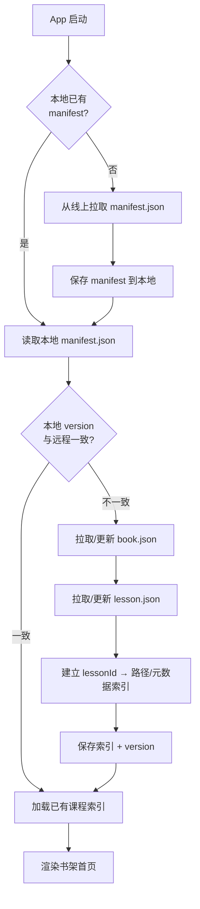

# Neo Concept — 内容清单与导入机制设计方案

> 状态：待用户确认
> 目标：确定课程 JSON、图片、清单文件的目录结构、命名规则与 App 发现/更新流程。

---

## 1. 核心决策建议

| 问题 | 建议方案 |
|------|----------|
| 课程数据放哪 | 每一节课都是一个独立 JSON；首次安装从线上拉取并缓存到本地，后续启动读取本地缓存 |
| Banner 图片 | 远程 HTTPS 加载，失败/离线时显示统一占位图；不提供「全部下载到本地」开关 |
| App 如何发现课程 | 从线上读取 `content/manifest.json` 总清单 + 每本书的 `book.json` |
| 内容更新 | 通过 `manifest.version` 检测远程内容变化，增量下载更新 |
| 首次安装 | 首次启动从线上拉取 manifest + 所有 book.json + 所有 lesson.json；banner 按需下载并缓存 |

> 说明：线上内容目录结构与 App 本地缓存目录结构保持一致（均为 `content/`），便于首次下载和后续增量更新。

---

## 2. 目录结构

```
content/
├── manifest.json                 # 全局清单
├── books/
│   ├── book01/
│   │   ├── book.json             # 本书元数据 + 课程索引
│   │   └── lessons/
│   │       ├── L01/
│   │       │   ├── lesson.json   # 课程数据（独立文件）
│   │       │   └── banner.webp   # 课程 banner（远程按需下载）
│   │       ├── L02/
│   │       │   ├── lesson.json
│   │       │   └── banner.webp
│   │       └── ...
│   ├── book02/
│   └── ...
```

### 2.1 命名规则

- 书目录：`book01`, `book02`, `book03`, `book04`
- 课目录：`L01`, `L02`, ... `L144`（固定两位或三位补零，与显示编号一致）
- 课程文件：`lesson.json`，每节课一个独立 JSON
- Banner 文件：`banner.webp`（优先 WebP，无则 fallback 到 `banner.jpg`）
- 音频：全部由本地 TTS 实时生成，不打包、不预录

---

## 3. 全局清单 `manifest.json`

```json
{
  "version": "2024.07.01-1",
  "schemaVersion": 1,
  "minAppVersion": "1.0.0",
  "updatedAt": "2024-07-01",
  "baseUrl": "https://cdn.example.com/neo-concept/content",
  "books": [
    {
      "id": "book01",
      "title": "First Things First",
      "subtitle": "新概念英语第一册",
      "order": 1,
      "totalLessons": 144,
      "path": "books/book01/book.json",
      "unlockedByDefault": true
    }
  ]
}
```

### 字段说明

- `version`：内容版本号，用于检测更新。
- `schemaVersion`：课程 JSON Schema 版本，App 校验用。
- `minAppVersion`：最低 App 版本，防止旧版本读取不兼容数据。
- `baseUrl`：内容根目录的远程 URL，App 用 `baseUrl + 相对路径` 下载文件。
- `books`：书列表，每本书指向自己的 `book.json`。

---

## 4. 单本书清单 `book.json`

```json
{
  "id": "book01",
  "title": "First Things First",
  "subtitle": "新概念英语第一册",
  "order": 1,
  "totalLessons": 144,
  "lessons": [
    {
      "id": "book01-L01",
      "displayNumber": "01",
      "title": "Excuse me!",
      "path": "lessons/L01/lesson.json",
      "banner": {
        "remote": "lessons/L01/banner.webp",
        "placeholder": "banner_placeholder"
      }
    }
  ]
}
```

### 字段说明

- `id`：全局唯一课程 ID，后续用户进度、统计都绑定此 ID。
- `displayNumber`：显示用的课号（如 01、144）。
- `path`：相对 `book.json` 的课程 JSON 路径。
- `banner.remote`：banner 的相对路径，完整 URL 为 `manifest.baseUrl + books/book01/lessons/L01/...`。
- `banner.placeholder`：App 内置占位图资源名，加载失败/离线时统一显示。

---

## 5. 单课 JSON Schema（草案）

```json
{
  "id": "book01-L01",
  "bookId": "book01",
  "displayNumber": "01",
  "title": "Excuse me!",
  "subtitle": "",
  "banner": {
    "remote": "banner.webp",
    "placeholder": "banner_placeholder"
  },
  "introduction": {
    "knowledgePoints": ["疑问句 'Is this your...?' 的用法", "礼貌用语 'Excuse me'"],
    "speakingScenarios": ["在公共场合向陌生人询问物品归属"],
    "learningObjectives": ["能用 'Is this your...?' 询问物品归属", "能听懂并回应 'Yes, it is.' / 'Pardon?'"]
  },
  "text": {
    "paragraphs": [
      {
        "id": "p1",
        "sentences": [
          { "id": "s1", "text": "Excuse me!" },
          { "id": "s2", "text": "Yes?" },
          { "id": "s3", "text": "Is this your handbag?" },
          { "id": "s4", "text": "Pardon?" },
          { "id": "s5", "text": "Is this your handbag?" },
          { "id": "s6", "text": "Yes, it is." },
          { "id": "s7", "text": "Thank you very much." }
        ]
      }
    ]
  },
  "vocabulary": [
    {
      "word": "excuse",
      "phonetic": "/ɪkˈskjuːs/",
      "translation": "原谅；借口",
      "example": "Excuse me, where is the station?",
      "contextSentence": "Excuse me! Is this your handbag?"
    },
    {
      "word": "handbag",
      "phonetic": "/ˈhændbæɡ/",
      "translation": "手提包",
      "example": "She bought a new handbag.",
      "contextSentence": "Is this your handbag?"
    }
  ],
  "exercises": {
    "fillInBlanks": [
      {
        "id": "fb1",
        "sentence": "______ me! Is this your handbag?",
        "answer": "Excuse",
        "options": ["Excuse", "Sorry", "Please", "Hello"]
      }
    ],
    "spelling": [
      {
        "id": "sp1",
        "word": "excuse",
        "phonetic": "/ɪkˈskjuːs/",
        "translation": "原谅；借口",
        "contextSentence": "Excuse me! Is this your handbag?"
      }
    ],
    "comprehension": {
      "questions": [
        {
          "id": "cq1",
          "question": "What does the woman ask?",
          "options": [
            "Is this your coat?",
            "Is this your handbag?",
            "Is this your car?",
            "Is this your watch?"
          ],
          "answer": 1,
          "explanation": "原文中男士问的是 'Is this your handbag?'。"
        }
      ]
    },
    "speaking": {
      "sentences": [
        { "id": "ss1", "text": "Excuse me!" },
        { "id": "ss2", "text": "Is this your handbag?" }
      ]
    }
  }
}
```

### 关键约定

- `introduction`：课前导读内容，包含知识点、口语场景、学习目标，用于课前导读页展示。
- `text.paragraphs[].sentences[]`：按句子拆分，每句有唯一 ID，用于朗读高亮。
- `vocabulary`：每个词必须包含 `contextSentence`（含该词的课文原句），供拼写练习错误反馈用。
- `exercises`：所有练习题由生成器侧生成，App 端只负责渲染和校验。
- 音频：不随课程 JSON 携带，全部由本地 TTS 实时生成。

---

## 6. App 导入/发现流程



### 流程说明

1. **首次启动**：本地无缓存，从远程 `manifestUrl` 拉取 `manifest.json` 并保存。
2. **后续启动**：先读本地 manifest，再与远程 version 对比。
3. **版本一致**：直接加载本地缓存的课程索引。
4. **版本不一致**：按 manifest 增量拉取变更的 `book.json` 和 `lesson.json`（未变更的复用本地文件）。
5. **索引内容**：lessonId、标题、banner URL、本地缓存路径、解锁顺序等。
6. **渲染书架首页**。

> 注意：banner 不随首次同步批量下载，进入课程页时按需下载并缓存。

---

## 7. 内容更新策略

- **检测更新**：每次启动对比本地 manifest.version 与远程 manifest.version。
- **增量更新**：只下载版本发生变化的 `book.json` / `lesson.json`，未变更文件复用本地缓存。
- **进度保留**：用户进度以 `lessonId` 为键；只要 `lessonId` 不变，更新后进度保留。
- **破坏性变更**：如果 `lessonId` 或 Schema 发生重大变化，提升 `schemaVersion`，旧版本 App 拒绝读取并提示升级 App。
- **离线可用**：更新检测需要网络；若离线则使用本地缓存内容，不阻塞学习。

---

## 8. 首次安装与离线策略

### 首次安装

- App 本身不预置任何课程 JSON 或 banner。
- 首次启动进入「初始化/同步」界面，从远程拉取：
  1. `manifest.json`
  2. 所有 `book.json`
  3. 所有 `lesson.json`
- 同步完成后保存到本地缓存，之后无需网络即可学习。
- Banner 不批量下载，进入课程页时按需拉取并缓存。

### 离线策略

- 课程文本、练习题等核心内容在首次同步后完全离线可用。
- Banner 离线时显示 App 内置统一占位图。
- 无「全部下载到本地」开关，简化实现。
- 若用户完全未进行过首次同步，则显示「需要网络连接以初始化课程」提示。

---

## 9. 已确认决策

1. 每节课为独立 JSON 文件。
2. Banner 远程加载，使用统一占位图，不提供「全部下载」开关。
3. 首次安装从线上拉取所有课程 JSON 并缓存，之后离线可用。
4. 音频全部由本地 TTS 实时生成，不预录、不打包。

> 仍需确认：线上内容托管地址（`manifestUrl` / `baseUrl`）由谁提供？生成器是否直接输出符合本目录结构的文件？
