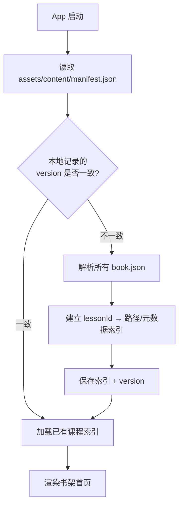

# Neo Concept — 内容清单与导入机制设计方案

> 状态：待用户确认
> 目标：确定课程 JSON、图片、清单文件的目录结构、命名规则与 App 发现/更新流程。

---

## 1. 核心决策建议

| 问题 | 建议方案 |
|------|----------|
| 课程数据放哪 | 随 App 打包进 `assets/content/`，启动时读取本地 JSON |
| Banner 图片 | 优先走 HTTPS 远程加载，本地缓存 + 离线占位；同时支持「全部下载到本地」开关 |
| App 如何发现课程 | 读取 `content/manifest.json` 总清单 + 每本书的 `book.json` |
| 内容更新 | 随 App 版本更新；通过 `manifest.version` 检测并重索引 |
| 首次安装 | 预置所有课程 JSON 和占位图；完整 banner 按需下载或用户手动预下载 |

> 说明：这与「把生成的图片导入静态资源目录」并不冲突——生成器仍然把图片放在 `content/` 下，但构建时可选择只把压缩后的占位图/缩略图打包，完整 banner 放到 CDN 或服务器上以减小 APK。

---

## 2. 目录结构

```
content/
├── manifest.json                 # 全局清单
├── books/
│   ├── book01/
│   │   ├── book.json             # 本书元数据 + 课程索引
│   │   ├── images/
│   │   │   └── thumbnail.webp    # 本书封面缩略图（可选）
│   │   └── lessons/
│   │       ├── L01/
│   │       │   ├── lesson.json   # 课程数据
│   │       │   └── banner.webp   # 本地 banner（如启用全离线）
│   │       ├── L02/
│   │       │   ├── lesson.json
│   │       │   └── banner.webp
│   │       └── ...
│   ├── book02/
│   └── ...
```

### 2.1 命名规则

- 书目录：`book01`, `book02`, `book03`, `book04`
- 课目录：`L01`, `L02`, ... `L144`（固定两位或三位补零，与显示编号一致）
- 课程文件：`lesson.json`
- Banner 文件：`banner.webp`（优先 WebP，无则 fallback 到 `banner.jpg`）
- 音频：原则上由本地 TTS 实时生成，不随课程打包；如需预录，放在 `audio/` 子目录下

---

## 3. 全局清单 `manifest.json`

```json
{
  "version": "2024.07.01-1",
  "schemaVersion": 1,
  "minAppVersion": "1.0.0",
  "updatedAt": "2024-07-01",
  "books": [
    {
      "id": "book01",
      "title": "First Things First",
      "subtitle": "新概念英语第一册",
      "order": 1,
      "totalLessons": 144,
      "path": "books/book01/book.json",
      "thumbnail": "books/book01/images/thumbnail.webp",
      "unlockedByDefault": true
    }
  ]
}
```

### 字段说明

- `version`：内容版本号，用于检测更新。
- `schemaVersion`：课程 JSON Schema 版本，App 校验用。
- `minAppVersion`：最低 App 版本，防止旧版本读取不兼容数据。
- `books`：书列表，每本书指向自己的 `book.json`。

---

## 4. 单本书清单 `book.json`

```json
{
  "id": "book01",
  "title": "First Things First",
  "subtitle": "新概念英语第一册",
  "order": 1,
  "totalLessons": 144,
  "lessons": [
    {
      "id": "book01-L01",
      "displayNumber": "01",
      "title": "Excuse me!",
      "path": "lessons/L01/lesson.json",
      "banner": {
        "local": "lessons/L01/banner.webp",
        "remote": "https://cdn.example.com/neo-concept/book01/L01/banner.webp",
        "fallbackColor": "#F2F2F2"
      }
    }
  ]
}
```

### 字段说明

- `id`：全局唯一课程 ID，后续用户进度、统计都绑定此 ID。
- `displayNumber`：显示用的课号（如 01、144）。
- `path`：相对 `book.json` 的课程 JSON 路径。
- `banner.local`：本地 banner 路径（如开启全离线模式）。
- `banner.remote`：远程 banner URL（默认模式）。
- `banner.fallbackColor`：图片加载失败或离线时的占位背景色。

---

## 5. 单课 JSON Schema（草案）

```json
{
  "id": "book01-L01",
  "bookId": "book01",
  "displayNumber": "01",
  "title": "Excuse me!",
  "subtitle": "",
  "banner": {
    "local": "banner.webp",
    "remote": "https://cdn.example.com/neo-concept/book01/L01/banner.webp",
    "fallbackColor": "#F2F2F2"
  },
  "text": {
    "paragraphs": [
      {
        "id": "p1",
        "sentences": [
          { "id": "s1", "text": "Excuse me!" },
          { "id": "s2", "text": "Yes?" },
          { "id": "s3", "text": "Is this your handbag?" },
          { "id": "s4", "text": "Pardon?" },
          { "id": "s5", "text": "Is this your handbag?" },
          { "id": "s6", "text": "Yes, it is." },
          { "id": "s7", "text": "Thank you very much." }
        ]
      }
    ]
  },
  "vocabulary": [
    {
      "word": "excuse",
      "phonetic": "/ɪkˈskjuːs/",
      "translation": "原谅；借口",
      "example": "Excuse me, where is the station?",
      "contextSentence": "Excuse me! Is this your handbag?",
      "audio": null
    },
    {
      "word": "handbag",
      "phonetic": "/ˈhændbæɡ/",
      "translation": "手提包",
      "example": "She bought a new handbag.",
      "contextSentence": "Is this your handbag?",
      "audio": null
    }
  ],
  "exercises": {
    "fillInBlanks": [
      {
        "id": "fb1",
        "sentence": "______ me! Is this your handbag?",
        "answer": "Excuse",
        "options": ["Excuse", "Sorry", "Please", "Hello"]
      }
    ],
    "spelling": [
      {
        "id": "sp1",
        "word": "excuse",
        "phonetic": "/ɪkˈskjuːs/",
        "translation": "原谅；借口",
        "contextSentence": "Excuse me! Is this your handbag?"
      }
    ],
    "comprehension": {
      "questions": [
        {
          "id": "cq1",
          "question": "What does the woman ask?",
          "options": [
            "Is this your coat?",
            "Is this your handbag?",
            "Is this your car?",
            "Is this your watch?"
          ],
          "answer": 1,
          "explanation": "原文中男士问的是 'Is this your handbag?'。"
        }
      ]
    },
    "speaking": {
      "sentences": [
        { "id": "ss1", "text": "Excuse me!" },
        { "id": "ss2", "text": "Is this your handbag?" }
      ]
    }
  }
}
```

### 关键约定

- `text.paragraphs[].sentences[]`：按句子拆分，每句有唯一 ID，用于朗读高亮。
- `vocabulary`：每个词必须包含 `contextSentence`（含该词的课文原句），供拼写练习错误反馈用。
- `exercises`：所有练习题由生成器侧生成，App 端只负责渲染和校验。
- `audio`：默认 `null`，由本地 TTS 生成；如需预录音频可填相对路径。

---

## 6. App 导入/发现流程



### 流程说明

1. 启动时读取 `manifest.json`。
2. 对比本地存储的 `contentVersion`：
   - 一致：直接加载缓存的课程索引。
   - 不一致：解析每本 `book.json`，建立 lesson 索引，更新缓存。
3. 索引内容：lessonId、标题、banner URL/本地路径、文件路径、解锁顺序等。
4. 渲染书架首页。

---

## 7. 内容更新策略

- **无后台静默更新**：内容更新随 App 版本发布。
- **版本检测**：通过 `manifest.version` 判断是否需要重建索引。
- **进度保留**：用户进度以 `lessonId` 为键；只要 `lessonId` 不变，更新后进度保留。
- **破坏性变更**：如果 `lessonId` 或 Schema 发生重大变化，提升 `schemaVersion`，旧版本 App 拒绝读取并提示升级。

---

## 8. 首次安装与离线策略

### 默认模式（推荐）

- APK 中打包所有 `lesson.json` 和占位图。
- Banner 默认从 `banner.remote` 加载，缓存到本地。
- 离线时显示占位背景色/图案。

### 全离线模式（可选）

- 在「设置 → 离线内容管理」中提供「下载全部图片」。
- 下载后把远程 banner 保存到与 `banner.local` 对应的位置。
- 之后优先读取本地 banner，不再请求网络。

---

## 9. 待确认问题

1. Banner 是否全部打包进 APK？还是默认远程 + 缓存？（本方案推荐后者）
2. 生成器是否直接输出 `content/` 目录结构，还是输出中间格式再转换？
3. 是否需要预录音频？还是全部依赖本地 TTS？
4. `lessonId` 命名规则是否接受 `book01-L01` 这种形式？
