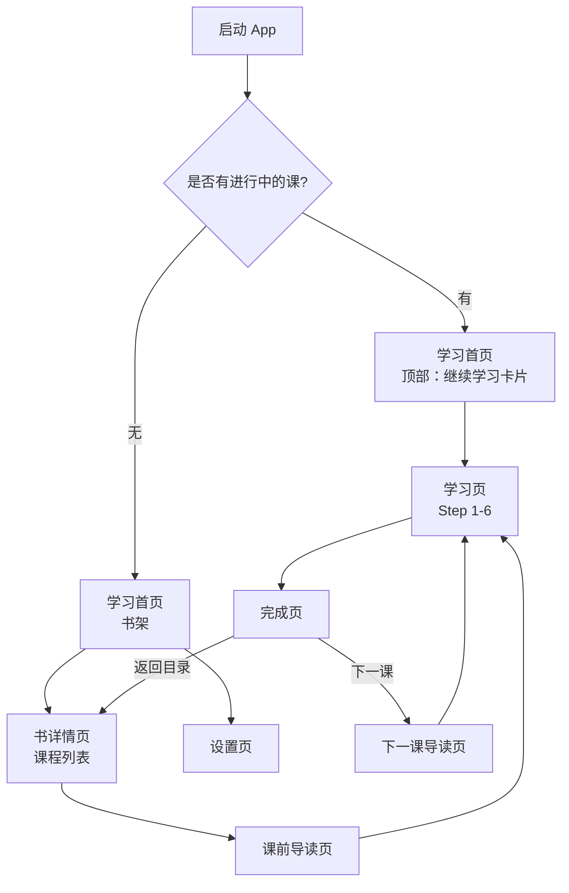
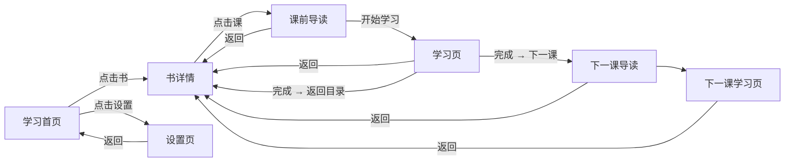

# Neo Concept — 信息架构与导航流程方案

> 状态：待用户确认
> 设计原则：极简、围绕「快速学习」核心场景，避免过早堆砌功能。

---

## 1. 入口与导航

- **无底部 Tab**：整个 App 以「学习首页」为唯一主页。
- **设置入口**：首页左上角设置图标，点击进入设置页。
- 统计、复习、收藏等功能暂不提供；后续如需加入，可在设置页中增设入口。

---

## 2. 页面层级与跳转

---

## 3. 各页面核心元素

### 3.1 学习首页（书架）

- **顶部栏**：
  - 左上角：设置图标。
  - 中间/左侧：大字号应用名或「学习」标题（Swiss 风格）。
- **继续学习卡片**（仅当有进行中的课时显示）：
  - 书名 + 课名 + 当前步骤。
  - 进度条或步骤小圆点。
  - 主按钮：「继续学习」。
- **4 本书书架**：
  - 网格或列表展示 4 本书。
  - 每本书：编号、书名、副标题、进度/状态。
  - 当前进行中的书：强调色边框或标签。
  - 未解锁的书：锁定状态 + 低透明度。

### 3.2 书详情页（课程列表）

- **顶部**：返回键 + 书名 + 本书总进度。
- **课程列表**：
  - 每行：课号、课标题、状态图标。
  - 状态：未开始 / 进行中 / 已完成 / 口语待补。
  - 所有课程均可点击，无锁定限制。
- 点击课程进入「课前导读页」。

### 3.3 课前导读页

- **顶部**：返回键 + 课程标题。
- **主体**：
  - Banner 图（远程加载 / 占位图）。
  - 课程标题 + 课号。
  - 本课导读内容：知识点、口语场景、学习目标等。
- **底部按钮**：「开始学习」，点击进入 Step 1。
- 从「继续学习」卡片恢复时，**跳过导读页**，直接进入上次学习步骤。

### 3.4 学习页

- 全屏沉浸式。
- 顶部：返回键 + 标题 + 6 步小圆点。
- 主体：6 步 HorizontalPager（详见课程交互设计 spec）。
- 底部：主操作按钮。
- 返回键统一回到「书详情页」。

### 3.5 完成页

- 作为 Step 6 展示。
- 显示本课重点词汇列表。
- 操作：
  - 「下一课」：直接进入下一课 Step 1。
  - 「返回目录」：回到书详情页。

### 3.6 设置页

- **TTS 语速 / 音色**
- **字体大小**：三档切换（跟随系统 / 标准 / 大），不采用无级滑条。
- **清除图片与音频缓存**：仅清除 HTTPS banner 图片缓存和 TTS/音频缓存，不影响用户学习进度。
- **离线内容管理**
- **关于 / 开源协议**

---

## 4. 返回栈行为

- 课前导读页是课程入口，返回回到书详情；点击「开始学习」进入 Step 1。
- 学习页与下一课学习页应视为同类型页面，用户在学习流中按返回应回到书详情，而不是上一课。
- 从「继续学习」卡片恢复时，跳过导读页，直接进入上次学习步骤。

---

## 5. 关键决策点

1. **底部 Tab**：无，首页即唯一主页，设置从首页左上角进入。
2. **启动默认页**：学习首页。
3. **首页是否显示继续学习卡片**：是，有进行中的课时置顶显示。
4. **点击课程后是否进入预览/导读页**：是，进入课前导读页，用户可查看知识点/场景后再开始学习；继续学习恢复时跳过导读。
5. **书与课程是否顺序解锁**：否，全部自由开放；只保留完成状态标记。
6. **学习页**：全屏沉浸式，无系统级导航干扰。
