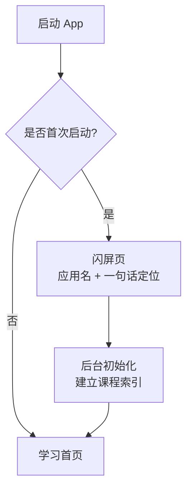

# Neo Concept — 首次启动与引导流程设计方案

> 状态：待用户确认
> 前提：课程 JSON 随 APK 打包；TTS/ASR/词典模型为本地内置；无账号、无云端同步。

---

## 1. 设计原则

- **极简**：首次启动只做最必要的事，不堆欢迎页、不选水平、不登录。
- **不阻塞**：资源初始化在后台进行，用户可尽快进入首页。
- **按需请求权限**：只在口语练习真正需要麦克风时才请求，首次启动不弹权限。
- **无网络依赖**：所有核心内容已打包，首次启动无需联网。

---

## 2. 首次启动流程

---

## 3. 闪屏页

**显示内容**：

- 应用名：NEO CONCEPT（大写，Swiss 风格）。
- 一句话定位：系统化英语学习工具。
- 底部：转圈加载动画 + 「课程内容初始化中…」。

**行为**：

- 显示 1–2 秒，同时后台建立课程索引。
- 索引建立完成后自动进入首页。
- 用户不可跳过；若索引已缓存，闪屏时间可缩短。
- 纯文字，不展示 Logo。

---

## 4. 后台初始化

**做什么**：

1. 读取 `assets/content/manifest.json`。
2. 读取每本书的 `book.json`。
3. 建立 `lessonId → 课程元数据` 的内存/本地索引。
4. 将索引写入本地缓存，供下次快速启动使用。

**不做什么**：

- 不下载任何远程资源（banner 按需加载）。
- 不加载 TTS/ASR/词典模型（首次使用时懒加载）。
- 不请求任何权限。
- 不展示水平选择、兴趣标签等问卷。

---

## 5. 权限策略

| 权限 | 首次启动 | 首次使用相关功能时 |
|------|----------|--------------------|
| 麦克风 | 不请求 | 进入 Step 5 口语练习时请求 |
| 存储/文件 | 不请求 | Android 导出学习记录时按需请求；Android 11+ 若使用私有目录则无需 |
| 通知 | 不请求 | 当前版本不需要 |
| 网络 | 不请求 | 应用本身不请求，banner 加载依赖系统网络状态 |

### 权限策略说明

- **麦克风**：这是口语练习必需的硬件。首次启动时不弹窗，等用户主动点进 Step 5 并点击录音按钮时再请求。这样请求有明确上下文，用户更容易接受。
- **存储/文件**：App 所有学习内容、进度、缓存都放在 App 私有目录（Android `getFilesDir()` / iOS `Documents` 沙盒），Android 11+ 不需要额外存储权限。只有未来做「导出学习记录到 Download」时才需要 `WRITE_EXTERNAL_STORAGE`，那时再请求。
- **通知**：当前版本没有每日提醒、学习提醒等功能，所以不需要通知权限。
- **网络**：Android/iOS 应用不需要像浏览器那样请求「网络权限」。banner 图片加载依赖设备是否联网，App 只需要在代码里检查网络状态，不需要弹权限请求。

**麦克风权限处理**：

- 用户首次点击口语练习的录音按钮时，弹出系统权限请求。
- 若用户拒绝：
  - 显示提示「口语练习需要麦克风权限，可在设置中开启」。
  - 提供「跳过口语」按钮，不阻塞学习流程。
- 若用户永久拒绝：在口语练习页面显示提示「麦克风权限未开启，口语练习不可用」，并提供「跳过口语」按钮。

---

## 6. TTS / 词典 / ASR 模型加载

- **TTS 模型（Piper ONNX）**：首次播放任意语音时懒加载；加载期间显示小加载指示。
- **词典（ECDICT SQLite）**：首次查词时懒加载；可预加载到内存或按需查询。
- **ASR 模型（Whisper GGML）**：首次进入口语练习时加载；加载期间显示「语音识别模型加载中…」。

**不显示首次加载引导页**：避免给用户「这个 App 很重」的印象。

---

## 7. 错误与边界情况

| 场景 | 处理 |
|------|------|
| 课程索引建立失败 | 显示「课程内容加载失败，请重新安装应用」，退出或重试 |
| 闪屏期间用户切到后台 | 继续初始化，完成后进入首页；若进程被杀，下次重新初始化 |
| 首次启动后立刻退出 | 下次启动重新走闪屏 + 初始化流程 |

---

## 8. 关键决策点

1. **无欢迎页/引导页**：直接闪屏后进入首页。
2. **无水平选择**：用户可自由选择任何书/课，App 不判断水平。
3. **无首次权限弹窗**：权限按需请求。
4. **模型懒加载**：TTS/词典/ASR 不在启动时加载，减少闪屏等待。
5. **索引预建立**：课程清单索引在首次启动时建立并缓存，之后启动直接读缓存。

---

## 9. 已确认决策

1. **闪屏页**：纯文字，不展示 Logo。
2. **初始化提示**：底部显示转圈加载动画 + 「课程内容初始化中…」。
3. **使用提示**：当前版本靠界面自解释，不加首次使用提示；开源后用户多了再考虑。
