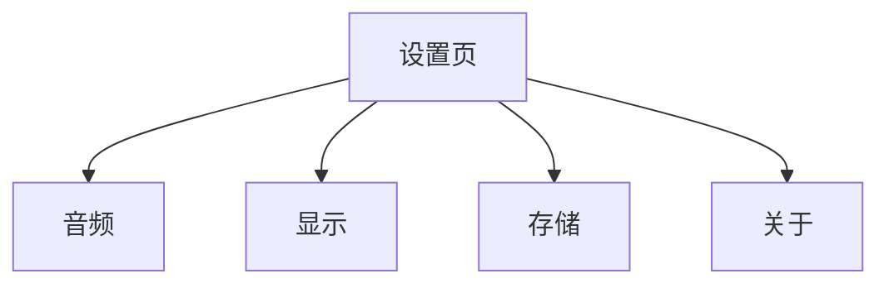

# Neo Concept — 设置页面设计方案

> 状态：已确认
> 入口：学习首页左上角设置图标
> 前提：无底部 Tab，无深色模式

---

## 1. 页面结构

设置页为垂直分组列表，共 4 组：音频、显示、存储、关于。

---

## 2. 设置项

### 2.1 音频

| 设置项 | 类型 | 默认值 | 说明 |
|--------|------|--------|------|
| TTS 语速 | 三档选择 | 1.0x | 0.8x / 1.0x / 1.2x |
| TTS 音色 | 单选 | 默认 | 若 Piper 只打包一个音色，则此选项禁用并显示「默认」 |

### 2.2 显示

| 设置项 | 类型 | 默认值 | 说明 |
|--------|------|--------|------|
| 字体大小 | 三档选择 | 跟随系统 | 跟随系统 / 标准 / 大 |

### 2.3 存储

| 设置项 | 类型 | 说明 |
|--------|------|------|
| 清除图片与音频缓存 | 按钮 | 删除 banner 图片缓存和 TTS 音频缓存，不影响学习进度 |
| 导出学习记录 | 按钮 | 将 `LessonProgress` + `AppProgress` 导出为 JSON 文件 |
| 导入学习记录 | 按钮 | 从 JSON 文件恢复学习记录（覆盖本地数据） |

> 导入/导出为后续功能，当前阶段可占位或隐藏。

### 2.4 关于

| 设置项 | 类型 | 说明 |
|--------|------|------|
| 应用版本 | 仅展示 | 如 v1.0.0 |
| 开源协议 | 跳转 | 展示 GPL-3.0 协议文本 |
| 致谢 / 第三方库 | 跳转 | 列出 Piper、Whisper、ECDICT 等 |

---

## 3. 设置项即时生效规则

| 设置项 | 生效方式 |
|--------|----------|
| TTS 语速 | 保存设置，下次播放音频时使用新语速（设置页只在首页可进入，不影响当前播放） |
| TTS 音色 | 保存设置，下次播放音频时使用新音色 |
| 字体大小 | 立即生效；设置页本身和返回后的所有页面立即刷新 |
| 清除缓存 | 立即执行；删除文件后显示 Toast「缓存已清除」 |
| 导入学习记录 | 弹出二次确认 Dialog，确认后覆盖本地进度并刷新首页状态 |

> 注意：设置入口只在学习首页左上角，学习页（Step 1–6）内不提供设置入口，因此设置变更不会影响当前正在播放的音频。

---

## 4. 页面交互

- **顶部栏**：返回键 + 「设置」标题。
- **列表项**：左侧标签，右侧当前值或箭头。
- **点击设置项**：
  - 单选/多档：底部弹出选择 Sheet 或进入二级选择页。
  - 按钮型：点击后弹确认 Dialog，确认后执行。
- **返回**：回到学习首页。

---

## 5. 关键决策点

1. **无深色模式开关**：跟随系统，不单独设置。
2. **TTS 音色**：若只内置一个音色，设置项禁用。
3. **字体大小三档**：避免无级滑条带来的布局测试成本。
4. **导入/导出学习记录**：数据模型已支持，但 UI 当前阶段可不做。
5. **设置变更即时生效**：除清除缓存和导入记录外，均不需要重启。

---

## 6. 已确认决策

1. **TTS 语速**：0.8x / 1.0x / 1.2x 三档，够用。
2. **导入学习记录**：覆盖本地数据，需二次确认。
3. **缓存占用大小**：不显示。
