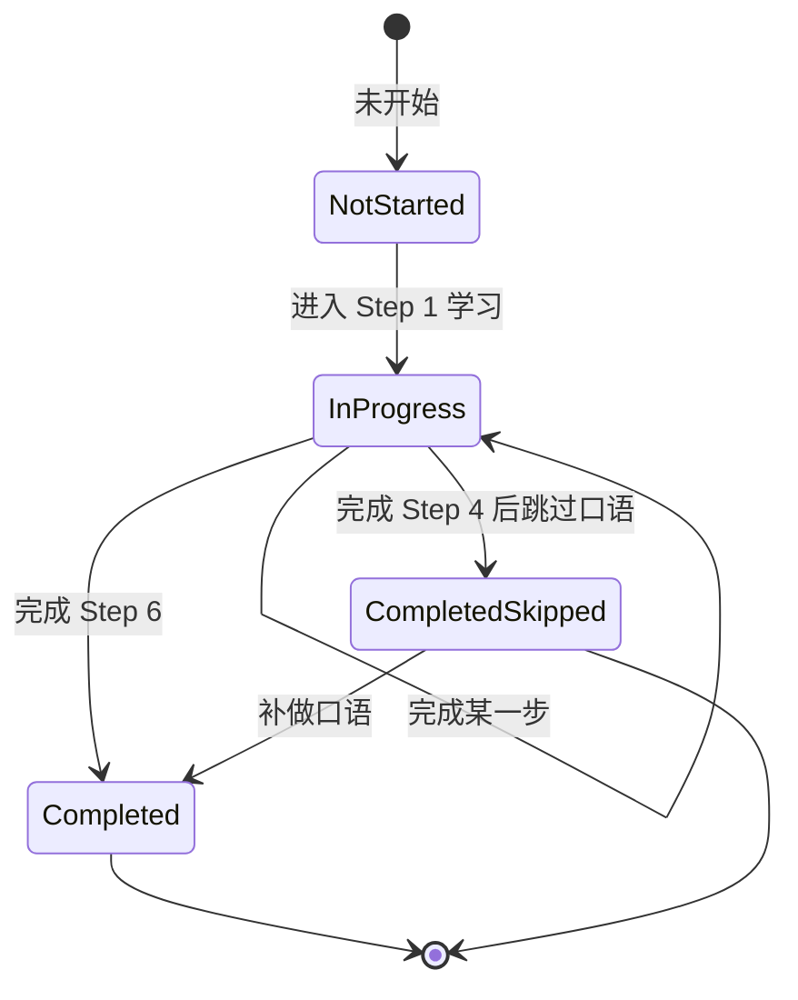

# Neo Concept — 用户进度与状态模型设计方案

> 状态：待用户确认
> 前提：无课程锁定；所有书与课自由开放；仅保留「是否学完」的状态标记。

---

## 1. 设计原则

- **最小化**：只记录支撑核心学习流程必需的状态，不记连续天数、不记每步历史、不记学习时长。
- **以 `lessonId` 为键**：用户进度与课程数据解耦，课程 JSON 更新后进度可保留。
- **实时计算书级进度**：不单独持久化「学到第几课」，从各课状态聚合得出。
- **断点恢复不自动跳转**：启动后回到首页，通过「继续学习」卡片让用户主动选择是否恢复。

---

## 2. 状态分层

### 2.1 课级别状态（LessonProgress）

```typescript
export interface LessonProgress {
  lessonId: string;           // 全局唯一，如 "book01-L01"
  completedSteps: number[];   // 已完成的步骤索引，Step 1-6 对应 1-6
  speakingSkipped: boolean;   // 口语练习是否被跳过
  lastPosition: number;       // 最后所在的步骤索引（用于恢复）
  updatedAt: number;          // 最后更新时间戳（毫秒）
}
```

**课程状态推导（UI 展示用）**：

| 状态 | 条件 |
|------|------|
| 未开始 | `completedSteps` 为空 |
| 进行中 | `completedSteps` 非空但未包含 Step 6 |
| 已完成 | `completedSteps` 包含 Step 6 |
| 已完成（口语待补） | `completedSteps` 包含 Step 6 且 `speakingSkipped === true` |

> 口语待补视为已完成的一种子状态，不影响下一课学习。

---

### 2.2 书级别状态（BookProgress）

不单独持久化，启动时从 `LessonProgress` 实时聚合：

```typescript
export interface BookProgress {
  bookId: string;
  completedLessons: number;   // 已完成课数
  inProgressLessons: number;  // 进行中课数
  totalLessons: number;       // 总课数
  lastLessonId: string | null; // 本书最后学习的课程
}
```

首页书架进度条直接使用 `completedLessons / totalLessons`。

---

### 2.3 应用级别状态（AppProgress）

```typescript
export interface AppProgress {
  totalCompletedLessons: number;  // 全应用已完成课数
  lastBookId: string | null;      // 最后学习的书
  lastLessonId: string | null;    // 最后学习的课
  lastPosition: number;           // 最后学习的步骤
}
```

> 不记录连续学习天数、不记录总学习时长、不记录每步正确率。

---

## 3. 状态流转



---

## 4. 各步骤完成条件

| 步骤 | 完成条件 |
|------|----------|
| Step 0 课前导读 | 点击「开始学习」即完成，记录 `lastPosition = 1` |
| Step 1 课文学习 | 用户点击「开始练习」按钮即完成 |
| Step 2 填词练习 | 所有空格均选对 |
| Step 3 拼写练习 | 所有词汇至少一次拼写正确 |
| Step 4 阅读理解 | 所有选择题均答对 |
| Step 5 口语练习 | 用户至少尝试跟读一句，或点击「跳过口语」 |
| Step 6 完成页 | 进入即完成 |

---

## 5. 断点恢复规则

- **启动 App**：一律进入学习首页，不自动进入学习页。
- **首页继续学习卡片**：
  - 仅当有进行中的课程时显示。
  - 如果当前书的下一课未开始且当前书尚未学完，可显示「继续学习 · 下一课」作为快捷入口。
  - 整本书学完后，不显示继续学习卡片。
  - 点击后跳过导读页，直接进入 `lastPosition` 步骤。
- **从书详情页进入**：
  - 未开始/进行中：进入导读页。
  - 已完成/口语待补：进入导读页（可复习）。
- **复习模式**：已完成课程进入学习页后，6 个步骤全部解锁，用户可自由滑动到任意步骤。
- **学习页返回**：统一回到书详情页。

---

## 6. 持久化策略

- 使用 Android `DataStore` / iOS `UserDefaults` 或 App 私有文件存储。
- `LessonProgress` 以 `lessonId` 为键，采用 Map/Dictionary 结构。
- 每次步骤完成/跳过时立即写入，保证异常退出不丢失进度。
- 升级 App 时保留进度文件。

---

## 7. 关键决策点

1. **不记录连续天数、学习时长、正确率**：只保留完成状态，符合最小化原则。
2. **书级进度实时计算**：不单独持久化，避免数据不一致。
3. **启动不自动进入学习页**：回到首页，由用户主动选择继续学习。
4. **口语跳过保留标记**：不影响完成状态，但 UI 显示「口语待补」。
5. **课程自由开放**：进度模型不处理锁定逻辑。

---

## 8. 已确认决策

1. **复习模式**：已完成课程可自由跳到任意步骤。
2. **继续学习卡片**：只显示进行中的课，或当前书下一节未开始的课；整本书学完后不提示。
3. **不记录每步错误历史**：只保留完成/跳过状态。

## 9. 导出/导入学习记录

进度数据（`LessonProgress` + `AppProgress`）本质上是纯本地用户数据。未来可以在设置页增加：

- **导出学习记录**：将所有进度序列化为 JSON 文件，用户可保存到本地或分享。
- **导入学习记录**：读取 JSON 文件并覆盖/合并本地进度，实现换机同步。

> 当前需求阶段不实现导出/导入，但数据模型已天然支持。
