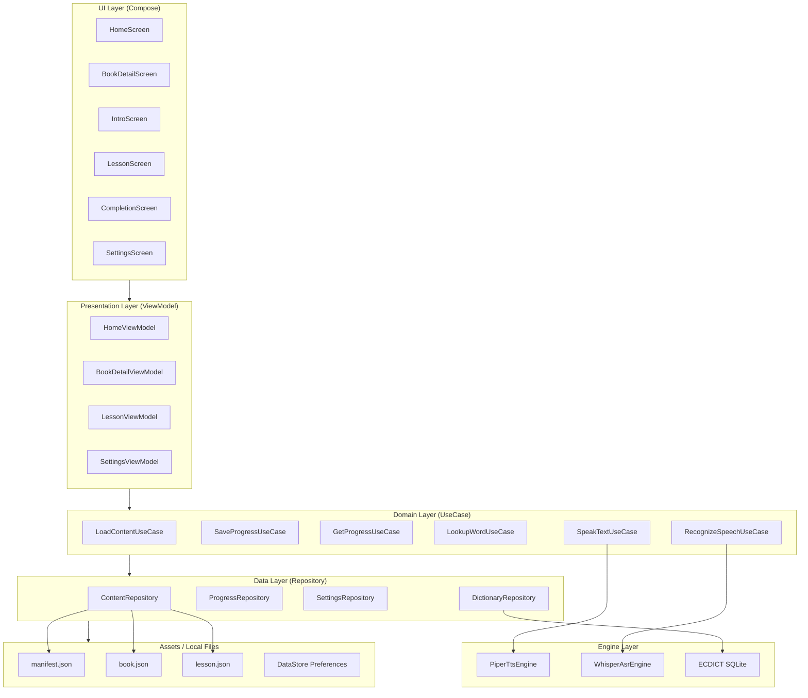
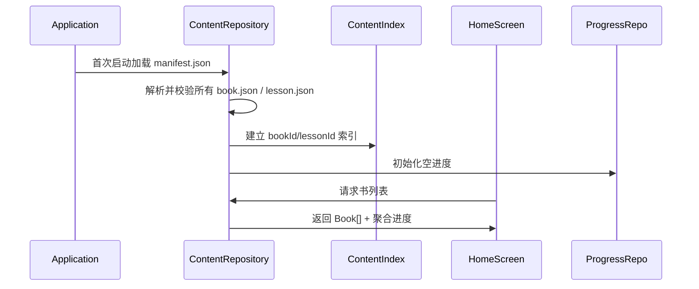
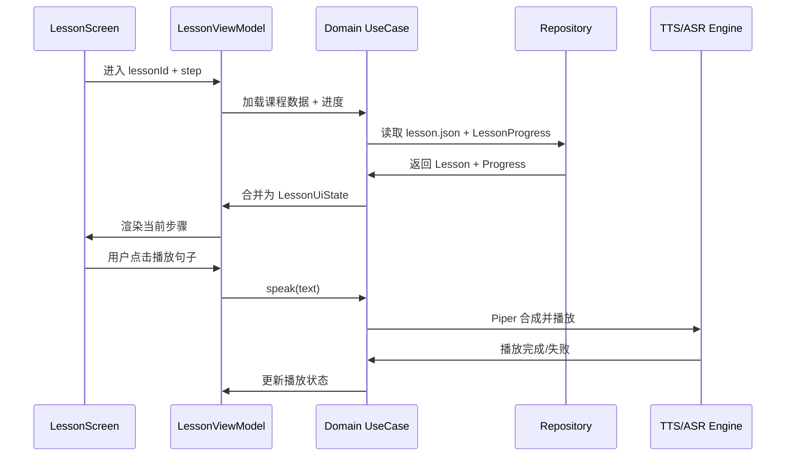
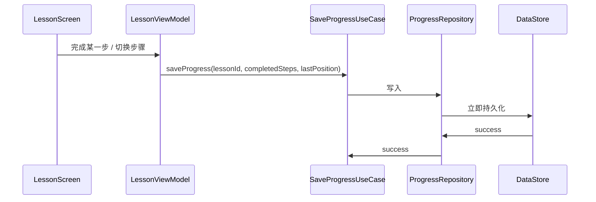

# Neo Concept — 系统架构设计

> 状态：待用户确认
> 目标：定义 Android 端整体模块划分、技术选型与数据流向，作为编码阶段的顶层约束。

---

## 1. 设计目标

- **离线优先**：所有课程内容打包进 APK，TTS/ASR/词典均在本地运行，无需网络即可学习。
- **低耦合**：课程数据、用户进度、语音引擎、UI 层彼此独立，便于后续替换引擎或扩展课程。
- **可测试**：业务逻辑沉淀在 ViewModel / UseCase 中，避免与 Android 框架过度耦合。
- **单端原生**：v1.0 仅 Android（Jetpack Compose），iOS 复用设计但不共享代码。

---

## 2. 技术栈

| 层级 | 技术选型 | 说明 |
|------|----------|------|
| UI | Jetpack Compose | 声明式 UI，配合 Material 3 组件 |
| 导航 | Jetpack Navigation Compose | 单 Activity，页面间导航 |
| 状态管理 | ViewModel + StateFlow | UI 状态与业务状态分离 |
| 依赖注入 | Hilt | 简化 Repository / Engine 注入 |
| 本地存储 | DataStore（Preferences）| 用户进度、设置项 |
| 结构化存储 | Room（可选）| 词典缓存、查词历史等结构化数据 |
| 内容读取 | Assets + Kotlin Serialization | JSON 课程文件从 assets 读取 |
| 图片加载 | Coil | Banner 远程加载 + 占位图 fallback |
| 权限 | Accompanist Permissions | 麦克风权限请求 |
| TTS | Piper ONNX Runtime | 本地英文 TTS |
| ASR | Whisper.cpp / Whisper GGML | 本地语音识别 |
| 词典 | ECDICT SQLite | 内置单词查询数据库 |
| 日志 | Timber | 开发期日志 |

---

## 3. 模块划分

采用 **单模块 + 按包分层** 结构（v1.0 不引入多模块，降低复杂度）：

```
app/
├── src/main/
│   ├── assets/content/          # 课程 JSON（manifest + books + lessons）
│   ├── java/com/neoconcept/
│   │   ├── NeoConceptApplication.kt
│   │   ├── di/                  # Hilt 模块
│   │   ├── ui/                  # Compose 页面与组件
│   │   │   ├── home/
│   │   │   ├── bookshelf/
│   │   │   ├── intro/
│   │   │   ├── lesson/
│   │   │   ├── completion/
│   │   │   ├── settings/
│   │   │   └── components/      # 复用组件
│   │   ├── viewmodel/           # ViewModel
│   │   ├── domain/              # UseCase / 业务逻辑
│   │   ├── data/                # Repository / 数据源
│   │   │   ├── content/         # 内容读取与索引
│   │   │   ├── progress/        # 进度读写
│   │   │   ├── settings/        # 设置读写
│   │   │   └── dictionary/      # 词典查询
│   │   ├── engine/              # TTS / ASR 引擎封装
│   │   │   ├── tts/
│   │   │   └── asr/
│   │   └── model/               # 数据类（DTO / Entity）
│   └── res/                     # 颜色、字体、主题、drawable
```

---

## 4. 整体架构图



---

## 5. 数据流向

### 5.1 课程启动流程



### 5.2 学习页数据流



### 5.3 进度保存



---

## 6. 各层职责

### 6.1 UI Layer

- 只负责渲染 `UiState`，不直接调用 Repository。
- 通过 `ViewModel` 暴露的 `StateFlow` 观察状态。
- 用户事件（点击、滑动、输入）全部转发给 `ViewModel`。
- Compose 组件按页面分包：`home/`、`bookshelf/`、`intro/`、`lesson/`、`settings/`。

### 6.2 Presentation Layer

- `ViewModel` 持有页面级状态，组合多个 UseCase。
- 处理页面生命周期相关逻辑（如进入后台时保存进度）。
- 将 `Domain Model` 转换为 `UiState`。

### 6.3 Domain Layer

- `UseCase` 为单一职责的业务操作单元。
- 例如 `SpeakTextUseCase` 负责调用 TTS 引擎并处理失败降级。
- 不依赖 Android 框架，便于单元测试。

### 6.4 Data Layer

- `ContentRepository`：从 assets 读取 JSON，建立索引，提供按 ID 查询。
- `ProgressRepository`：读写 `LessonProgress` / `AppProgress`，使用 DataStore。
- `SettingsRepository`：读写设置项（TTS 语速、字体大小等）。
- `DictionaryRepository`：查询 ECDICT SQLite。

### 6.5 Engine Layer

- `PiperTtsEngine`：封装 Piper ONNX Runtime，提供 `speak(text)` / `stop()`。
- `WhisperAsrEngine`：封装 Whisper.cpp，提供 `startListening()` / `stopListening()` / 置信度回调。
- 引擎初始化懒加载，首次使用时再加载模型。

---

## 7. 关键设计决策点

1. **单模块还是多模块？**
   - 推荐：v1.0 单模块，按包分层。
   - 可选：若计划后续拆 iOS 共享 Kotlin Multiplatform，可提前拆 `domain` / `data` 模块。

2. **是否使用 Room？**
   - 推荐：使用 Room 管理 ECDICT 词典查词缓存、查词历史。
   - 可选：若 ECDICT 直接读 SQLite 足够简单，可不用 Room。

3. **TTS/ASR 引擎是否统一接口？**
   - 推荐：定义 `TtsEngine` / `AsrEngine` 接口，Piper / Whisper 各自实现，便于替换。

4. **课程索引如何维护？**
   - 推荐：首次启动在后台构建 `ContentIndex`（bookId→lessons 映射），存入内存 + 轻量缓存。
   - 可选：每次启动重新扫描 assets。

5. **错误处理由哪一层负责？**
   - 推荐：UseCase 层捕获引擎/数据异常，转换为 `Result<T>` 或 `UiState.Error`，ViewModel 决定展示方式。

6. **是否使用 Compose Navigation 的 Type-Safe Navigation？**
   - 推荐：使用 Navigation Compose 2.8+ 的 type-safe API，以 `bookId` / `lessonId` 等强类型参数跳转。

---

## 8. 推荐方案（默认）

- 单模块按包分层。
- Compose + Navigation Compose + Hilt + ViewModel + StateFlow。
- DataStore 存进度/设置，Room 管理词典相关数据。
- Piper ONNX / Whisper.cpp 通过接口封装，懒加载。
- UseCase 层统一处理错误并转换为结果状态。
- 首次启动后台建立内容索引。
