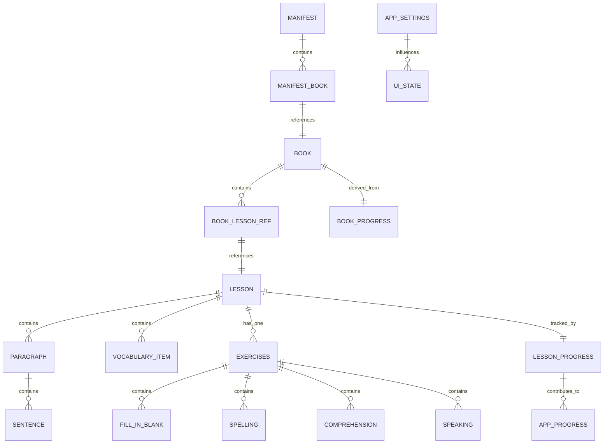

# Neo Concept — 数据模型设计

> 状态：已确认（与 `content-import-design.md` 对齐）
> 目标：定义课程内容、用户进度、设置、运行时状态的完整数据模型，作为编码阶段的契约。

---

## 1. 数据来源分类

| 分类 | 来源 | 持久化方式 | 说明 |
|------|------|------------|------|
| 课程内容 | `assets/content/` JSON | 打包进 APK | 只读，更新随 App 升级 |
| 用户进度 | 运行时产生 | DataStore Preferences | 读写，跨启动保留 |
| 应用设置 | 用户选择 | DataStore Preferences | 读写 |
| 词典数据 | ECDICT SQLite | 打包进 APK / 首次解压 | 只读 |
| 运行时状态 | 页面生命周期内 | 内存 | 不持久化 |

---

## 2. 课程内容模型

### 2.1 manifest.json

```kotlin
@Serializable
data class Manifest(
    val version: String,              // 内容集版本，如 "1.0.0"
    val schemaVersion: Int,           // 内容 schema 版本，如 1
    val minAppVersion: String,        // 最低 App 版本，如 "1.0.0"
    val updatedAt: String,            // 更新日期，如 "2026-07-05"
    val books: List<ManifestBook>     // 4 本书的清单
)

@Serializable
data class ManifestBook(
    val id: String,                   // 如 "book01"
    val title: String,                // 书名
    val subtitle: String,             // 副标题
    val order: Int,                   // 显示顺序
    val totalLessons: Int,            // 总课数
    val path: String                  // 相对 manifest.json 的路径，如 "books/book01/book.json"
)
```

### 2.2 book.json

```kotlin
@Serializable
data class Book(
    val id: String,
    val title: String,
    val subtitle: String,
    val order: Int,
    val totalLessons: Int,
    val lessons: List<BookLessonRef>  // 课程索引列表
)

@Serializable
data class BookLessonRef(
    val id: String,                   // 全局唯一课程 ID，如 "book01-L01"
    val displayNumber: String,        // 显示课号，如 "01"
    val title: String,                // 课文标题
    val path: String,                 // 相对 book.json 的路径，如 "lessons/L01/lesson.json"
    val banner: Banner                // 课程 banner 配置
)
```

### 2.3 lesson.json

```kotlin
@Serializable
data class Lesson(
    val id: String,
    val bookId: String,
    val displayNumber: String,
    val title: String,
    val subtitle: String,
    val banner: Banner,
    val introduction: Introduction,
    val text: Text,
    val vocabulary: List<VocabularyItem>,
    val exercises: Exercises
)

@Serializable
data class Banner(
    val local: String?,               // 本地相对路径，如 "banners/L01.webp"
    val remote: String?,              // 远程 HTTPS URL
    val placeholder: String           // App 内置占位图资源名
)

@Serializable
data class Introduction(
    val knowledgePoints: List<String>,
    val speakingScenarios: List<String>,
    val learningObjectives: List<String>
)

@Serializable
data class Text(
    val paragraphs: List<Paragraph>
)

@Serializable
data class Paragraph(
    val id: String,
    val sentences: List<Sentence>
)

@Serializable
data class Sentence(
    val id: String,                   // 句子唯一标识
    val text: String,                 // 完整英文句子
    val normalizedText: String? = null // ASR 比对用归一化文本
)

@Serializable
data class VocabularyItem(
    val id: String,
    val word: String,
    val phonetic: String,
    val translation: String,          // 中文释义
    val example: String,              // 例句
    val contextSentence: String       // 含该词的课文原句，用于拼写提示
)

@Serializable
data class Exercises(
    val fillInBlanks: List<FillInBlank>,
    val spelling: List<Spelling>,
    val comprehension: Comprehension,
    val speaking: Speaking
)

@Serializable
data class FillInBlank(
    val id: String,
    val sentence: String,             // 带空格的句子，如 "______ me!"
    val answer: String,               // 正确答案
    val options: List<String>         // 候选词（整题共用）
)

@Serializable
data class Spelling(
    val id: String,
    val vocabularyId: String          // 引用 vocabulary 中对应词条的 id
)

@Serializable
data class Comprehension(
    val questions: List<ComprehensionQuestion>
)

@Serializable
data class ComprehensionQuestion(
    val id: String,
    val question: String,
    val options: List<String>,        // 4 个选项
    val answer: Int,                  // 正确答案索引
    val explanation: String           // 解析
)

@Serializable
data class Speaking(
    val sentences: List<Sentence>
)
```

---

## 3. 用户进度模型

### 3.1 持久化结构

```kotlin
// 以 lessonId 为键，序列化为 JSON 字符串后存入 DataStore
@Serializable
data class LessonProgress(
    val lessonId: String,
    val completedSteps: List<Int>,    // 已完成的步骤索引 1-6
    val speakingSkipped: Boolean,
    val lastPosition: Int,            // 最后所在步骤
    val updatedAt: Long               // 毫秒时间戳
)

@Serializable
data class AppProgress(
    val totalCompletedLessons: Int,
    val lastBookId: String?,
    val lastLessonId: String?,
    val lastPosition: Int
)
```

### 3.2 运行时聚合结构

```kotlin
// 不持久化，从 LessonProgress 列表实时计算
data class BookProgress(
    val bookId: String,
    val completedLessons: Int,
    val inProgressLessons: Int,
    val totalLessons: Int,
    val lastLessonId: String?
)

// UI 层使用的课程状态
data class LessonStatus(
    val lessonId: String,
    val state: LessonState,           // NOT_STARTED / IN_PROGRESS / COMPLETED / COMPLETED_SKIPPED
    val lastPosition: Int?
)

enum class LessonState {
    NOT_STARTED,
    IN_PROGRESS,
    COMPLETED,
    COMPLETED_SKIPPED
}
```

---

## 4. 应用设置模型

```kotlin
@Serializable
data class AppSettings(
    val ttsSpeed: TtsSpeed = TtsSpeed.NORMAL,
    val fontScale: FontScale = FontScale.MEDIUM
)

enum class TtsSpeed(val value: Float) {
    SLOW(0.8f),
    NORMAL(1.0f),
    FAST(1.2f)
}

enum class FontScale(val value: Float) {
    SMALL(0.9f),
    MEDIUM(1.0f),
    LARGE(1.15f)
}
```

---

## 5. 词典模型

```kotlin
// ECDICT 查询结果映射
data class DictionaryEntry(
    val word: String,
    val phonetic: String?,
    val definition: String,           // 中文释义，多个用 \\n 分隔
    val exchange: String?,            // 时态/复数等变形
    val tag: String?                  // 词性标签
)

// 查词历史（可选，Room 表）
@Entity(tableName = "lookup_history")
data class LookupHistory(
    @PrimaryKey val word: String,
    val lookedUpAt: Long = System.currentTimeMillis()
)
```

---

## 6. 运行时 UI 状态模型

```kotlin
// 学习页状态
data class LessonUiState(
    val lesson: Lesson? = null,
    val progress: LessonProgress? = null,
    val currentStep: Int = 1,
    val isPlaying: Boolean = false,
    val playingSentenceId: String? = null,
    val isRecording: Boolean = false,
    val error: LessonError? = null,
    val isLoading: Boolean = true
)

sealed class LessonError {
    data object TtsUnavailable : LessonError()
    data object AsrUnavailable : LessonError()
    data class JsonParseFailed(val lessonId: String) : LessonError()
}

// 首页状态
data class HomeUiState(
    val books: List<BookWithProgress> = emptyList(),
    val continueLesson: ContinueLesson? = null,
    val isLoading: Boolean = true
)

data class BookWithProgress(
    val book: Book,
    val progress: BookProgress
)

data class ContinueLesson(
    val bookId: String,
    val lessonId: String,
    val lessonTitle: String,
    val lastPosition: Int,
    val bookProgressText: String
)
```

---

## 7. 数据关系图



---

## 8. 数据流动规则

1. **内容读取**：启动时读取 `manifest.json`，按需懒加载 `book.json` 和 `lesson.json`。
2. **进度写入**：每次步骤完成/切换/进入后台时立即保存 `LessonProgress`，并更新 `AppProgress`。
3. **状态聚合**：`BookProgress` / `LessonStatus` 不持久化，从 `LessonProgress` 实时计算。
4. **设置生效**：TTS 语速在引擎初始化时读取，运行时切换立即生效；字体大小通过 `CompositionLocalProvider` 全局影响。

---

## 9. 已确认决策

1. **课程内容结构**：以 `content-import-design.md` 为唯一来源，`manifest.json` / `book.json` / `lesson.json` 字段命名与其保持一致。
2. **填词候选词**：`FillInBlank.options` 整题共用一组候选词。
3. **拼写提示**：`Spelling` 通过 `vocabularyId` 引用 `VocabularyItem.contextSentence`，不为空。
4. **LessonProgress.completedSteps**：使用 `List<Int>`。
5. **AppSettings**：整体序列化为一个 JSON 对象。
6. **LookupHistory**：v1.0 不实现。
7. **DictionaryEntry**：保留原表字段，UI 展示时按需拆分。
